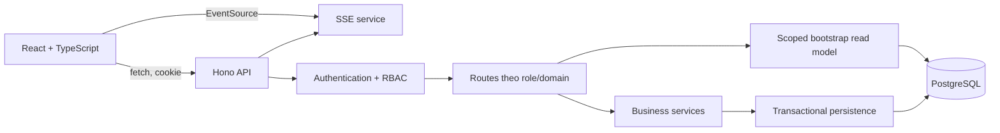
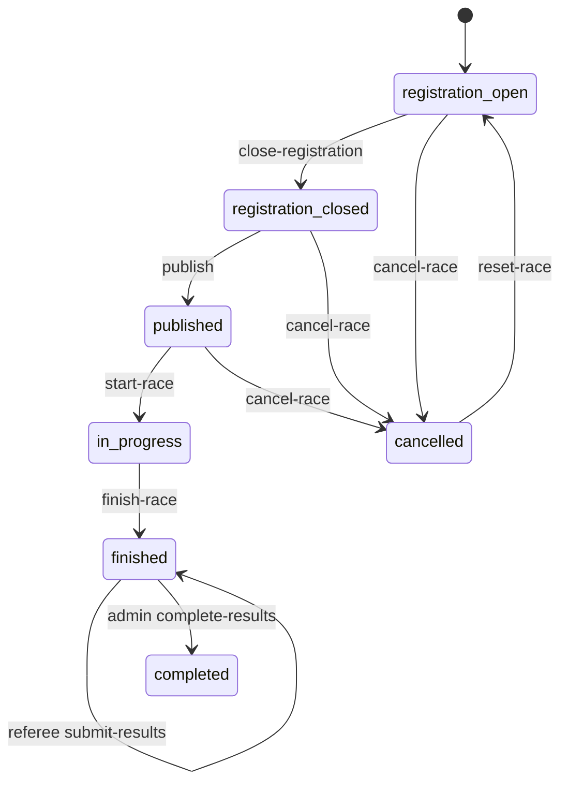

# TÀI LIỆU CHUẨN BỊ BẢO VỆ PROJECT

## Horse Racing Tournament Website

> Bản đối chiếu source ngày **20/07/2026**, tại commit `01aef55b`.  
> Hiện tại: **47 route API**, **5 vai trò**, **8 bootstrap scope**, **8 trạng thái vòng đời race**.  
> Tài liệu dùng để học bài nói, mở code minh họa, demo và trả lời phản biện.

---

## 1. Cách học nhanh

1. Học phần **Kịch bản thuyết trình 12-15 phút**.
2. Mở sẵn các file trong phần **Code cần trình bày**.
3. Tập đúng **luồng demo nhiều vai trò**.
4. Học bảng **47 API** và **toàn bộ status**.
5. Ôn phần **câu hỏi phản biện**.
6. Nếu chỉ được nói 5 phút, dùng **bản nói rút gọn** ở cuối.

Không đọc từng dòng code trước hội đồng. Khi mở một đoạn code, hãy nói theo bốn ý:

```text
Input → Validation → Thay đổi nghiệp vụ → Persistence/Response
```

---

## 2. Project làm gì?

Horse Racing Tournament Website quản lý toàn bộ quy trình một giải đua ngựa:

```text
Tạo giải
→ Tạo race và phân công referee
→ Owner đăng ký ngựa
→ Jockey đăng ký hoặc nhận lời mời
→ Admin duyệt cặp horse-jockey
→ Đóng đăng ký, tính rating/handicap/lane
→ Publish
→ Referee check-in
→ Spectator đặt cược
→ Start và finish race
→ Referee nhập/nộp kết quả
→ Admin official kết quả
→ Cập nhật rating và thanh toán cược
```

Đây không chỉ là website CRUD. Phần chính của project là:

- Workflow nhiều vai trò.
- State machine của race.
- Quy tắc đăng ký horse-jockey-referee.
- Rating và handicap có snapshot.
- Kết quả qua hai cấp Referee và Admin.
- Wallet, credit ledger và betting transaction.
- Live update bằng SSE.
- Kiểm soát race/bet đồng thời bằng row lock và conflict detection.

### Năm vai trò

| Vai trò | Chức năng chính |
|---|---|
| `admin` | Quản lý tournament, race, race class, user, approval, betting và kết quả official |
| `owner` | Tạo hồ sơ ngựa, đăng ký race, chọn hoặc mời jockey |
| `jockey` | Công bố hồ sơ, đăng ký race, chấp nhận/từ chối invitation |
| `referee` | Check-in entry, ghi kết quả từng ngựa, submit kết quả nháp |
| `spectator` | Xem race, nhận credit, đặt/hủy cược, theo dõi live và kết quả |

### Công nghệ

| Tầng | Công nghệ |
|---|---|
| Frontend | React 18, TypeScript, React Router, Vite, Tailwind CSS |
| Backend | Node.js ESM, Hono |
| Database | PostgreSQL |
| Auth | Session token, HttpOnly cookie, bcrypt |
| Live | Server-Sent Events và polling dự phòng |
| Data consistency | PostgreSQL transaction, `SELECT ... FOR UPDATE`, unique/check/foreign-key constraint |

---

## 3. Những thay đổi mới nhất phải nói đúng

So với bản tài liệu trước, source hiện tại có các điểm mới sau:

1. Có trang riêng [`AdminBettingPage.tsx`](../frontend/src/app/components/AdminBettingPage.tsx#L29) tại URL `/admin/betting`.
2. Admin được cấu hình `betLimit` cho từng race.
3. API mới `PATCH /api/admin/races/:raceId/bet-limit` làm tổng số route tăng từ 46 lên **47**.
4. Race mới mặc định giới hạn một bet là `50` credit nếu biến môi trường không đổi.
5. Migration `009` thêm cột `races.betLimit`.
6. Credit persistence mới bảo đảm ledger idempotent, không cộng cùng giao dịch hai lần.
7. Migration `010` bảo đảm một user chỉ nhận `starter_bonus` một lần.
8. Race lifecycle persistence khóa race và kiểm tra `expectedStatus`, trả `409` nếu request khác đã đổi state.
9. Betting persistence kiểm tra lại race, entry, thời hạn cược và bet limit bên trong transaction.
10. Thư mục `backend/test` đã bị xóa; `npm run check` hiện chỉ chạy typecheck và build. Không được nói rằng bản source hiện tại vẫn chạy 82 automated tests.

`Câu nói nên dùng:`

> Ở lần refactor mới, nhóm em tập trung tăng tính nhất quán của wallet, betting và race lifecycle. Những kiểm tra quan trọng không chỉ nằm trước transaction mà được kiểm tra lại sau khi khóa row trong PostgreSQL. Tuy nhiên bộ backend automated tests đã bị loại khỏi source hiện tại, nên đây là rủi ro cần khôi phục trước khi coi là production-ready.

---

## 4. Kịch bản thuyết trình 12-15 phút

### Slide 1 — Giới thiệu đề tài

`Nói:`

> Em xin trình bày Horse Racing Tournament Website. Hệ thống quản lý một giải đua ngựa xuyên suốt từ đăng ký ngựa và jockey, điều hành race, referee nhập kết quả đến cập nhật rating và thanh toán cược. Project có năm vai trò và backend quản lý các quy tắc nghiệp vụ bằng state machine, transaction và phân quyền.

### Slide 2 — Bài toán thực tế

`Nói:`

> Một race liên quan nhiều bên và mỗi bên thao tác ở thời điểm khác nhau. Owner không được tự duyệt ngựa, jockey phải xác nhận tham gia, referee chỉ được xử lý race được phân công và Admin mới được official kết quả. Nếu không quản lý trạng thái chặt, hệ thống có thể publish thiếu người, start khi chưa check-in hoặc thanh toán cược hai lần.

Rủi ro project xử lý:

- Một ngựa hoặc jockey không được đăng ký trùng ở race đang hoạt động.
- Chỉ ngựa `approved` và đúng rating range mới hợp lệ.
- Phải đủ đúng số horse-jockey pair và có referee mới đóng đăng ký.
- Tất cả entry phải `ready` hoặc `absent` trước khi start.
- Referee không thể official kết quả; Admin không thể complete khi chưa submitted.
- Không đặt/hủy cược khi betting window đã đóng.
- Không được trừ credit hoặc settle cùng bet hai lần khi có request đồng thời.

### Slide 3 — Kiến trúc



`Nói:`

> Frontend React không truy cập database trực tiếp. Mọi mutation đi qua Hono API. Backend xác thực session, kiểm tra role và business rule trước khi gọi persistence. Dữ liệu đọc được tổng hợp thành read model theo từng bootstrap scope. Live race nhận thông báo SSE và polling lại làm dự phòng.

Code:

- Middleware và mount route: [`backend/src/app.js`](../backend/src/app.js#L31)
- Dependency wiring: [`backend/src/index.js`](../backend/src/index.js#L21)
- HTTP client: [`frontend/src/app/services/api/client.ts`](../frontend/src/app/services/api/client.ts#L24)

### Slide 4 — Cấu trúc file

```text
frontend/src/
├── App.tsx                         # session, route guard, layout
└── app/
    ├── AppRoutes.tsx               # React routes và lazy loading
    ├── routing.ts                  # page/path/role mapping
    ├── components/
    │   ├── AdminBettingPage.tsx    # trang quản trị betting riêng
    │   ├── admin/                  # component Admin dùng lại
    │   └── liveRace/               # track và leaderboard
    └── services/api/
        ├── client.ts               # fetch, cookie, cache
        ├── types.ts                # shared DTO/types
        └── *Api.ts                 # API theo domain

backend/src/
├── app.js
├── routes/
│   ├── adminRoutes.js
│   └── admin/
│       ├── adminConfigurationRoutes.js
│       ├── adminRaceLifecycleRoutes.js
│       └── adminRaceRules.js
├── services/
│   ├── bootstrapService.js
│   ├── handicapService.js
│   ├── bettingService.js
│   └── creditService.js
└── db/persistence/
    ├── racePersistence.js
    ├── bettingPersistence.js
    ├── creditPersistence.js
    └── *SnapshotPersistence.js
```

`Nói:`

> File được chia theo trách nhiệm. Frontend tách API theo role/domain và route được lazy-load. Backend tách Admin configuration, lifecycle và rules. Persistence quan trọng dùng transaction nhỏ theo use case; snapshot persistence là fallback cho route cũ còn gọi writeDb.

### Slide 5 — Routing và frontend guard

`Nói:`

> App khôi phục user bằng GET /api/me. routing.ts xác định page nào dành cho role nào. AppRoutes lazy-load màn hình và dùng ID trong URL làm nguồn sự thật cho trang chi tiết. Trang Admin Betting mới có route riêng `/admin/betting` và chỉ role Admin được mở từ frontend.

Code:

- Khôi phục session và redirect: [`frontend/src/App.tsx`](../frontend/src/App.tsx#L45)
- Khai báo route Admin Betting: [`frontend/src/app/AppRoutes.tsx`](../frontend/src/app/AppRoutes.tsx#L26)
- Ma trận quyền trang: [`frontend/src/app/routing.ts`](../frontend/src/app/routing.ts#L33)
- URL quyết định horse hiện tại: [`frontend/src/app/AppRoutes.tsx`](../frontend/src/app/AppRoutes.tsx#L46)

Lưu ý:

> Frontend guard chỉ hỗ trợ UX. Bảo mật thật vẫn là middleware role ở backend.

### Slide 6 — Auth và phân quyền backend

`Nói:`

> Password được hash bằng bcrypt. Khi login thành công, backend tạo session và gửi token trong HttpOnly cookie. Mỗi request protected đọc cookie, tìm session chưa hết hạn rồi chỉ chấp nhận user có status active. Mỗi nhóm route áp dụng requireRole trước toàn bộ endpoint.

Code:

- Đọc cookie, session và user active: [`backend/src/services/authService.js`](../backend/src/services/authService.js#L20)
- Admin middleware: [`backend/src/routes/adminRoutes.js`](../backend/src/routes/adminRoutes.js#L129)
- Referee middleware: [`backend/src/routes/refereeRoutes.js`](../backend/src/routes/refereeRoutes.js#L38)
- Secure headers, body limit và CORS: [`backend/src/app.js`](../backend/src/app.js#L33)

### Slide 7 — Scoped bootstrap

`Nói:`

> Frontend không nhất thiết lấy toàn bộ database cho mọi trang. Hệ thống có tám scope là tournaments, race, horses, jockeys, live, results, betting và admin. Backend chỉ query nhóm bảng cần thiết rồi vẫn lọc visibility theo role. Frontend cache từng scope 10 giây, gộp request đang chạy cùng scope và xóa cache sau mutation.

Code:

- Tám scope: [`frontend/src/app/services/api/types.ts`](../frontend/src/app/services/api/types.ts#L344)
- Cache và request deduplication: [`frontend/src/app/services/api/client.ts`](../frontend/src/app/services/api/client.ts#L52)
- Bảng theo scope: [`backend/src/services/bootstrapService.js`](../backend/src/services/bootstrapService.js#L16)
- Lọc race/entry/horse theo user: [`backend/src/services/bootstrapService.js`](../backend/src/services/bootstrapService.js#L95)

### Slide 8 — Vòng đời race



`Nói:`

> Race không được đổi status tùy ý. Route lifecycle nhận một trong bảy action và kiểm tra trạng thái hiện tại. Khi đóng đăng ký, hệ thống yêu cầu đúng số pair, snapshot rating, tính handicap và gán lane. Khi complete-results, kết quả thành official, rating ngựa được cập nhật, replay được tạo và bet được settle.

| Action | Điều kiện/trạng thái chính |
|---|---|
| `close-registration` | `registration-open` → `registration-closed`, đủ đúng field size và referee |
| `publish` | `registration-closed` → `published` |
| `start-race` | `published` → `in-progress`; mọi entry ready/absent, đủ minimum ready |
| `finish-race` | `in-progress` → `finished/draft` |
| `complete-results` | `finished/submitted` → `completed/official` |
| `cancel-race` | Chỉ trước khi race bắt đầu; refund pending bet |
| `reset-race` | `cancelled` → `registration-open`, xóa registration/result cũ |

Code:

- Lifecycle: [`backend/src/routes/admin/adminRaceLifecycleRoutes.js`](../backend/src/routes/admin/adminRaceLifecycleRoutes.js#L32)
- Rule: [`backend/src/routes/admin/adminRaceRules.js`](../backend/src/routes/admin/adminRaceRules.js#L7)
- Conflict `409`: [`backend/src/routes/admin/adminRaceLifecycleRoutes.js`](../backend/src/routes/admin/adminRaceLifecycleRoutes.js#L557)

### Slide 9 — Chống race condition mới

`Nói:`

> Điểm mới là persistence khóa row race bằng SELECT FOR UPDATE và so sánh expectedStatus. Nếu hai Admin cùng bấm action, request đến sau phát hiện status trong database đã khác và trả 409 thay vì ghi đè. Khi settle, từng bet cũng được khóa và phải còn pending. Credit transaction có ID ổn định hoặc unique constraint để retry không cộng tiền hai lần.

Code:

- Khóa và kiểm tra state race: [`backend/src/db/persistence/racePersistence.js`](../backend/src/db/persistence/racePersistence.js#L243)
- Khóa bet trước settle: [`backend/src/db/persistence/racePersistence.js`](../backend/src/db/persistence/racePersistence.js#L361)
- Credit ledger idempotent: [`backend/src/db/persistence/creditPersistence.js`](../backend/src/db/persistence/creditPersistence.js#L8)

### Slide 10 — Rating và handicap

`Nói:`

> Rating ban đầu là công thức nội bộ từ bốn chỉ số. Sau khi ngựa đã thi đấu, overallRating trong database là nguồn chính. Khi đóng đăng ký, rating được snapshot vào entry để lịch sử có thể tái lập dù hồ sơ ngựa thay đổi sau đó.

```text
initialRating = speed × 35%
              + stamina × 25%
              + form × 30%
              + health × 10%
```

```text
assignedWeight = topWeight - (highestFieldRating - horseRating)
assignedWeight = clamp(assignedWeight, classMinWeight, classMaxWeight)
```

Ví dụ class có khoảng 110-135 lb, rating cao nhất field là 90:

- Rating 90 mang `135 lb`.
- Rating 85 mang `130 lb`.
- Rating 60 tính ra 105 nhưng được clamp thành `110 lb`.

Rating sau race:

```text
actualScore = (fieldSize - position) / (fieldSize - 1)
ratingChange = 10 × (actualScore - expectedScore) × fieldFactor
```

- Field dưới 4 ngựa không đổi rating.
- Rating change bị giới hạn từ `-8` đến `+8`.

Code:

- Rating ban đầu/chính thức: [`backend/src/services/handicapService.js`](../backend/src/services/handicapService.js#L24)
- Cân mang: [`backend/src/services/handicapService.js`](../backend/src/services/handicapService.js#L64)
- Rating sau race: [`backend/src/services/handicapService.js`](../backend/src/services/handicapService.js#L134)

### Slide 11 — Owner, Jockey và Referee

`Nói:`

> Owner chỉ đăng ký ngựa thuộc sở hữu, đã approved và phù hợp race. Owner có thể ghép jockey đã approved hoặc gửi invitation. Jockey chấp nhận thì pairing chuyển pending-admin. Admin duyệt mới tạo entry approved. Referee được phân công check-in từng entry, nhập outcome, position và finish time, sau đó submit kết quả nháp.

Code:

- Owner flow: [`backend/src/routes/ownerRoutes.js`](../backend/src/routes/ownerRoutes.js#L315)
- Jockey flow: [`backend/src/routes/jockeyRoutes.js`](../backend/src/routes/jockeyRoutes.js#L102)
- Admin approvals: [`backend/src/routes/adminRoutes.js`](../backend/src/routes/adminRoutes.js#L705)
- Referee readiness/result: [`backend/src/routes/refereeRoutes.js`](../backend/src/routes/refereeRoutes.js#L185)

### Slide 12 — Betting và bet limit

`Nói:`

> Spectator chỉ đặt cược race published, entry approved, không absent hoặc disqualified và trước giờ chạy ít nhất một phút. Số tiền là credit nguyên dương, không vượt số dư và không vượt betLimit của race. Admin có trang riêng xem pot, số bet, payout, refund, số dư spectator và sửa bet limit khi race chưa completed/cancelled.

Flow đặt cược:

```text
Validate request
→ Lock race và kiểm tra published/deadline/betLimit
→ Lock entry và kiểm tra bettable
→ Lock wallet và kiểm tra balance
→ Trừ credit
→ Insert pending bet
→ Insert credit ledger
→ COMMIT
```

Code:

- Trang Admin Betting: [`frontend/src/app/components/AdminBettingPage.tsx`](../frontend/src/app/components/AdminBettingPage.tsx#L29)
- API đổi limit: [`backend/src/routes/adminRoutes.js`](../backend/src/routes/adminRoutes.js#L221)
- Validation spectator: [`backend/src/routes/spectatorRoutes.js`](../backend/src/routes/spectatorRoutes.js#L109)
- Transaction đặt/hủy: [`backend/src/db/persistence/bettingPersistence.js`](../backend/src/db/persistence/bettingPersistence.js#L10)
- Migration cột betLimit: [`database/postgres/migrations/009_race_bet_limit.sql`](../database/postgres/migrations/009_race_bet_limit.sql#L1)

### Slide 13 — Credit ledger và starter bonus

`Nói:`

> Wallet giữ số dư hiện tại, còn creditTransactions là ledger bất biến để truy vết lý do thay đổi. Spectator mới nhận starter bonus; login liên tiếp nhận daily bonus tăng dần đến cap. Bản mới dùng ID starter_bonus:userId và unique partial index để một user không nhận starter bonus hai lần, kể cả khi đổi role hoặc có request đồng thời.

Các loại credit transaction:

```text
starter_bonus
daily_login_bonus
bet_placed
bet_cancelled
bet_refunded
bet_payout
admin_adjustment
```

Code:

- Loại transaction và daily reward: [`backend/src/services/creditService.js`](../backend/src/services/creditService.js#L4)
- Stable starter bonus ID: [`backend/src/services/creditService.js`](../backend/src/services/creditService.js#L127)
- Cấp bonus khi đổi role: [`backend/src/routes/admin/adminConfigurationRoutes.js`](../backend/src/routes/admin/adminConfigurationRoutes.js#L183)
- Transaction cấp một lần: [`backend/src/db/persistence/userPersistence.js`](../backend/src/db/persistence/userPersistence.js#L10)
- Unique index: [`database/postgres/migrations/010_starter_bonus_unique.sql`](../database/postgres/migrations/010_starter_bonus_unique.sql#L27)

### Slide 14 — Live race

`Nói:`

> LiveRace lấy snapshot bằng bootstrap scope live, sau đó dùng EventSource nhận sự kiện cập nhật theo raceId. Polling 15 giây là fallback nếu SSE bị gián đoạn. Track và official leaderboard được tách thành component riêng.

Code:

- SSE URL: [`frontend/src/app/services/api/client.ts`](../frontend/src/app/services/api/client.ts#L20)
- EventSource/polling: [`frontend/src/app/components/LiveRace.tsx`](../frontend/src/app/components/LiveRace.tsx#L408)
- SSE backend: [`backend/src/services/liveRaceEvents.js`](../backend/src/services/liveRaceEvents.js#L1)

### Slide 15 — Kiểm tra, giới hạn và hướng phát triển

`Nói:`

> Bản hiện tại qua TypeScript typecheck và production build. Tuy nhiên backend test suite đã bị xóa khỏi cấu trúc mới, nên em không xem đây là trạng thái production-ready. Các giới hạn khác là SSE dùng EventEmitter trong một process, bootstrap chưa có pagination đầy đủ và một số route vẫn dùng snapshot writeDb. Bước tiếp theo là khôi phục test, thêm E2E/concurrency test, rồi bổ sung pagination và Redis Pub/Sub khi scale ngang.

Thứ tự nên cải thiện:

1. Khôi phục backend automated tests vào `npm run check`.
2. Thêm E2E cho auth → registration → referee → official → payout.
3. Thêm concurrency tests cho đặt cược, starter bonus và race action.
4. Pagination/filter server-side.
5. Redis Pub/Sub cho nhiều backend instance.
6. Chuyển các mutation còn dùng snapshot fallback sang row-level transaction.

---

## 5. Toàn bộ 47 route API

### Quy ước

- Backend mặc định: `http://127.0.0.1:4000`.
- Prefix: `/api`.
- JSON body dùng `Content-Type: application/json`.
- Frontend gửi session cookie bằng `credentials: 'include'`.
- Lỗi thường trả `{ "message": "..." }`.
- `400`: dữ liệu/rule sai; `403`: sai role; `404`: không tồn tại; `409`: trùng hoặc state conflict.

### A. Public/bootstrap — 5

| # | Method | Endpoint | Mô tả |
|---:|---|---|---|
| 1 | GET | `/api` | Thông tin API |
| 2 | GET | `/api/health` | Health check |
| 3 | GET | `/api/live/races/:raceId/events` | SSE live race |
| 4 | GET | `/api/bootstrap` | Full read model để tương thích |
| 5 | GET | `/api/bootstrap/:scope` | Read model theo scope |

Scope hợp lệ: `tournaments`, `race`, `horses`, `jockeys`, `live`, `results`, `betting`, `admin`.

### B. Auth — 4

| # | Method | Endpoint | Body | Mô tả |
|---:|---|---|---|---|
| 6 | GET | `/api/me` | — | Lấy user hiện tại |
| 7 | POST | `/api/login` | `{ email, password }` | Login, tạo session; spectator có thể nhận daily reward |
| 8 | POST | `/api/register` | `{ name, email, password, role }` | Đăng ký; owner/jockey/referee chờ duyệt, spectator active |
| 9 | POST | `/api/logout` | — | Xóa session/cookie |

### C. Owner — 5

| # | Method | Endpoint | Mô tả |
|---:|---|---|---|
| 10 | GET | `/api/owner/portal` | Dữ liệu portal của owner |
| 11 | GET | `/api/owner/race-registration?raceId=:id` | Dữ liệu/lựa chọn hợp lệ cho race |
| 12 | POST | `/api/owner/horses` | Tạo hồ sơ ngựa |
| 13 | POST | `/api/owner/horses/:id` | Cập nhật ngựa thuộc owner |
| 14 | POST | `/api/owner/race-registrations` | Đăng ký ngựa và chọn/mời jockey |

Body route #14 thường gồm:

```json
{
  "tournamentId": "...",
  "raceId": "...",
  "horseId": "...",
  "jockeyUserId": "..."
}
```

### D. Jockey — 4

| # | Method | Endpoint | Mô tả |
|---:|---|---|---|
| 15 | GET | `/api/jockey/portal` | Profile, race, registration, invitation |
| 16 | POST | `/api/jockey/profile` | Lưu/công bố hồ sơ jockey |
| 17 | POST | `/api/jockey/race-registrations` | Đăng ký sẵn sàng cho race |
| 18 | POST | `/api/jockey/invitations/:id` | `{ decision: "accepted" | "rejected" }` |

### E. Referee — 3 route declaration

| # | Method | Endpoint | Mô tả |
|---:|---|---|---|
| 19 | POST | `/api/referee/races/:raceId/:action` | Chỉ chấp nhận action `submit-results` |
| 20 | POST | `/api/referee/race-entries/:entryId/readiness/:status` | Status: `ready`, `absent`, `incident`, `scratched` |
| 21 | POST | `/api/referee/race-entries/:entryId/result` | Ghi position/time/outcome/incident |

Lưu ý: bốn readiness URL là một route declaration có path parameter.

### F. Spectator/betting — 4

| # | Method | Endpoint | Body | Mô tả |
|---:|---|---|---|---|
| 22 | GET | `/api/spectator/wallet` | — | Balance, streak, daily reward và bet history |
| 23 | GET | `/api/spectator/pots` | — | Pot theo race và entry |
| 24 | POST | `/api/spectator/bets` | `{ raceEntryId, amount }` | Đặt bet trong transaction |
| 25 | POST | `/api/spectator/bets/:betId/cancel` | — | Hủy pending bet và hoàn credit |

### G. Notification — 2

| # | Method | Endpoint | Mô tả |
|---:|---|---|---|
| 26 | GET | `/api/notifications` | Thông báo của user hiện tại |
| 27 | POST | `/api/notifications/:id/read` | Đánh dấu đã đọc |

### H. Admin — 20

#### Approval và dashboard

| # | Method | Endpoint | Mô tả |
|---:|---|---|---|
| 28 | GET | `/api/admin/approvals` | Danh sách chờ duyệt |
| 29 | GET | `/api/admin/betting` | Race betting summaries và spectator statistics |
| 30 | PATCH | `/api/admin/races/:raceId/bet-limit` | Đặt số nguyên dương hoặc `null` để unlimited |
| 31 | GET | `/api/admin/race-builder` | Tournament, race class, referee và setting cho form |
| 32 | POST | `/api/admin/approvals/:entityType/:id` | Duyệt/từ chối entity |

`entityType`: `horse`, `account`, `jockeyRace`, `horseRace`, `pairing`.

#### Tournament

| # | Method | Endpoint | Mô tả |
|---:|---|---|---|
| 33 | POST | `/api/admin/tournaments` | Tạo tournament |
| 34 | PATCH | `/api/admin/tournaments/:tournamentId` | Cập nhật tournament |
| 35 | DELETE | `/api/admin/tournaments/:tournamentId` | Xóa tournament và dữ liệu liên quan theo rule |

#### Race

| # | Method | Endpoint | Mô tả |
|---:|---|---|---|
| 36 | POST | `/api/admin/races` | Tạo race, referee assignment, race-class snapshot, betLimit |
| 37 | PATCH | `/api/admin/races/:raceId` | Sửa race chưa publish |
| 38 | DELETE | `/api/admin/races/:raceId` | Xóa race chưa publish |
| 39 | POST | `/api/admin/races/:raceId/:action` | State machine action |

Action route #39:

```text
close-registration
publish
start-race
finish-race
complete-results
cancel-race
reset-race
```

#### Cấu hình và race class

| # | Method | Endpoint | Mô tả |
|---:|---|---|---|
| 40 | GET | `/api/admin/settings` | Lấy system settings |
| 41 | PATCH | `/api/admin/settings` | Cập nhật settings |
| 42 | GET | `/api/admin/race-classes` | Danh sách race class |
| 43 | POST | `/api/admin/race-classes` | Tạo race class |
| 44 | PATCH | `/api/admin/race-classes/:raceClassId` | Cập nhật/deactivate class |

#### User management

| # | Method | Endpoint | Mô tả |
|---:|---|---|---|
| 45 | GET | `/api/admin/users` | Danh sách user không có password |
| 46 | PATCH | `/api/admin/users/:id` | Cập nhật role/status; đổi sang spectator cấp starter credit một lần |
| 47 | DELETE | `/api/admin/users/:id` | Soft-disable bằng `suspended` |

### Tổng số

| Nhóm | Số route |
|---|---:|
| Public/bootstrap | 5 |
| Auth | 4 |
| Owner | 5 |
| Jockey | 4 |
| Referee | 3 |
| Spectator | 4 |
| Notification | 2 |
| Admin | 20 |
| **Tổng** | **47** |

Nguồn route: [`backend/src/routes`](../backend/src/routes), prefix được mount tại [`backend/src/app.js`](../backend/src/app.js#L60).

---

## 6. Toàn bộ status và type quan trọng

### Race lifecycle

| Status | Ý nghĩa |
|---|---|
| `draft` | Giá trị schema/legacy; flow tạo race hiện tại vào thẳng `registration-open` |
| `registration-open` | Đang nhận đăng ký |
| `registration-closed` | Đã khóa đăng ký, có lane/rating snapshot/handicap |
| `published` | Danh sách xuất phát công khai; referee check-in; betting mở nếu còn thời gian |
| `in-progress` | Race đang chạy |
| `finished` | Đã chạy xong, chờ/đang xử lý kết quả |
| `completed` | Kết quả official, rating và bet đã settle |
| `cancelled` | Race bị hủy; pending bet được refund |

### Race resultStatus

| Status | Ý nghĩa |
|---|---|
| `draft` | Referee chưa submit |
| `submitted` | Referee đã nộp, chờ Admin |
| `official` | Admin đã duyệt chính thức |

### Race entry status

| Status | Ý nghĩa |
|---|---|
| `approved` | Entry hợp lệ |
| `rejected` | Bị từ chối/không tính vào field |
| `scratched` | Bị rút khỏi race |

### preRaceStatus

| Status | Ý nghĩa |
|---|---|
| `pending` | Chưa đến bước kiểm tra |
| `ready-for-referee` | Đã đóng đăng ký, chờ referee |
| `ready` | Sẵn sàng xuất phát |
| `absent` | Vắng mặt |
| `incident` | Có sự cố chưa giải quyết |
| `scratched` | Bị rút/loại trước race |

### resultOutcome

| Outcome | Ý nghĩa |
|---|---|
| `finished` | Về đích bình thường, cần position/time |
| `dnf` | Did Not Finish |
| `fell` | Ngã |
| `injured` | Chấn thương |
| `disqualified` | Bị loại |

### Tournament

| Status | Ý nghĩa |
|---|---|
| `registration` | Trạng thái tương thích cũ |
| `registration-open` | Giai đoạn đăng ký |
| `approvals` | Giai đoạn duyệt |
| `active` | Giải đang vận hành |
| `completed` | Giải hoàn thành |

### User/account

| Status | Ý nghĩa |
|---|---|
| `pending` | Chờ Admin duyệt |
| `active` | Được authenticate và đăng nhập |
| `approved` | Legacy schema value; runtime duyệt account thành `active` |
| `rejected` | Bị từ chối |
| `suspended` | Bị vô hiệu hóa mềm |
| `locked` | Bị khóa |

Quan trọng: [`authenticate`](../backend/src/services/authService.js#L20) chỉ chấp nhận user `active`.

### Horse profile

| Status | Ý nghĩa |
|---|---|
| `draft` | Nháp |
| `pending` | Chờ duyệt |
| `approved` | Hợp lệ để đăng ký nếu thỏa các rule khác |
| `rejected` | Bị từ chối |
| `retired` | Đã giải nghệ |

### Horse race registration

| Status | Ý nghĩa |
|---|---|
| `pending-jockey` | Chờ jockey trả lời |
| `pending-admin` | Jockey đã nhận, chờ Admin |
| `approved` | Pair được duyệt |
| `rejected` | Bị từ chối |
| `cancelled` | Đăng ký bị hủy |

### Jockey profile

| Status | Ý nghĩa |
|---|---|
| `draft` | Hồ sơ nháp |
| `pending` | Chờ duyệt |
| `published` | Hồ sơ công khai |
| `rejected` | Bị từ chối |
| `archived` | Đã lưu trữ |

### Jockey race registration

| Status | Ý nghĩa |
|---|---|
| `pending` | Chờ duyệt |
| `approved` | Được duyệt |
| `rejected` | Bị từ chối |

### Jockey invitation

| Trường | Status | Ý nghĩa |
|---|---|---|
| `status` | `pending` | Chưa phản hồi |
| `status` | `accepted` | Jockey chấp nhận |
| `status` | `rejected` | Jockey từ chối |
| `status` | `cancelled` | Invitation bị hủy |
| `adminStatus` | `null` | Chưa tới Admin |
| `adminStatus` | `pending` | Chờ Admin |
| `adminStatus` | `approved` | Admin duyệt pairing |
| `adminStatus` | `rejected` | Admin từ chối pairing |

### Horse jockeyConfirmation

| Status | Ý nghĩa |
|---|---|
| `waiting-owner` | Chưa có lời mời đang chờ |
| `pending-jockey` | Chờ jockey |
| `pending-admin` | Chờ Admin |
| `confirmed` | Pairing đã duyệt |
| `rejected` | Quy trình bị từ chối |

### Referee assignment

| Status | Ý nghĩa |
|---|---|
| `assigned` | Đã phân công |
| `confirmed` | Referee xác nhận |
| `declined` | Từ chối |
| `removed` | Bị gỡ |

### Referee report

| Status | Ý nghĩa |
|---|---|
| `draft` | Nháp |
| `submitted` | Đã nộp |
| `reviewed` | Đã xem xét |
| `dismissed` | Đã bác/đóng |

### Bet

| Status | Ý nghĩa | Credit |
|---|---|---|
| `pending` | Cược đang hiệu lực | Đã trừ stake |
| `won` | Cược thắng | Nhận payout |
| `lost` | Cược thua | Không hoàn |
| `cancelled` | User hủy trước deadline | Hoàn stake |
| `refunded` | Hệ thống hoàn do race hủy | Hoàn stake |

### Credit transaction type

| Type | Ý nghĩa |
|---|---|
| `starter_bonus` | Credit ban đầu; tối đa một lần/user |
| `daily_login_bonus` | Thưởng đăng nhập theo streak |
| `bet_placed` | Trừ credit khi đặt cược |
| `bet_cancelled` | Hoàn do user hủy |
| `bet_refunded` | Hoàn do hệ thống/race hủy |
| `bet_payout` | Trả thưởng thắng |
| `admin_adjustment` | Điều chỉnh hoặc chuẩn hóa legacy ledger |

---

## 7. Kịch bản demo

### Chuẩn bị dữ liệu

- Có account cho đủ 5 role.
- Có một tournament active.
- Có race với đúng 10 horse-jockey pair approved và referee assignment.
- Có race ở `published` để cược/check-in.
- Có race ở `finished/submitted` để demo official.
- Spectator có wallet credit.

Phân biệt:

- Đóng đăng ký cần đúng `maxHorsesPerRace`, mặc định 10 pair.
- Start cần tất cả entry đã check `ready` hoặc `absent`, trong đó tối thiểu `minReadiedParticipants`, mặc định 5 entry ready.

### Demo 8-10 phút

1. Mở trang tournament/race công khai.
2. Login Admin, mở Race Class Catalog.
3. Tạo race, chọn class, lịch, referee và bet limit.
4. Owner chọn ngựa approved và mời jockey.
5. Jockey chấp nhận invitation.
6. Admin duyệt pairing.
7. Admin đóng đăng ký, chỉ lane, ratingSnapshot và handicap.
8. Admin publish.
9. Mở `/admin/betting`, chỉ bet limit và thống kê.
10. Spectator đặt bet hợp lệ; thử vượt limit để chứng minh validation.
11. Referee đánh dấu mọi entry `ready` hoặc `absent`; ít nhất 5 ready.
12. Admin start rồi finish.
13. Referee nhập result và submit.
14. Admin complete-results.
15. Mở Results để chỉ official result/ratingChange.
16. Mở wallet/Admin Betting để chỉ `won/lost`, payout và balance.

### Một lỗi nên demo chủ động

Chọn một trong các lỗi:

- Bet vượt `betLimit`.
- Start khi còn entry `ready-for-referee` hoặc `incident`.
- Referee không được phân công cố ghi kết quả.
- Admin complete khi result chưa `submitted`.
- Hai request race action xung đột và request sau nhận `409`.

`Câu chuyển khi demo:`

> Nút trên giao diện chỉ hỗ trợ người dùng. Nếu em gọi API trực tiếp sai thứ tự hoặc sai role, backend vẫn từ chối bằng business rule tương ứng.

---

## 8. Câu hỏi phản biện và câu trả lời

### 1. Project khác CRUD ở đâu?

> Project có state machine, approval nhiều vai trò, snapshot rating, referee workflow, transaction betting, idempotent credit ledger, conflict detection và live update.

### 2. Vì sao chọn Hono?

> Hono nhẹ, middleware rõ và phù hợp Node ESM. Với quy mô hiện tại, route dễ đọc và test. Khi hệ thống lớn hơn có thể thêm schema validation, tracing và dependency container mà không đổi business domain.

### 3. Frontend ẩn nút có phải bảo mật không?

> Không. User có thể tự gọi HTTP. Bảo mật thật là session validation, requireRole, ownership/resource check và database constraint ở backend.

### 4. Vì sao HttpOnly cookie?

> JavaScript không đọc được token nên giảm nguy cơ token bị lấy bởi XSS. `credentials: include` giúp browser tự gửi cookie. Production vẫn cần cấu hình Secure, SameSite và CSRF defense phù hợp.

### 5. Scope bootstrap có phải cơ chế bảo mật không?

> Không. Scope tối ưu bảng/payload cần đọc. Visibility filtering và middleware mới là lớp bảo mật.

### 6. Tại sao vẫn giữ full bootstrap?

> Để tương thích consumer cũ. Frontend mới dùng scope theo màn hình. Với dữ liệu lớn vẫn cần pagination thay vì chỉ dựa vào scope.

### 7. Vì sao race cần cả `status` và `resultStatus`?

> `status` mô tả giai đoạn vận hành, còn `resultStatus` mô tả giai đoạn duyệt kết quả. Race có thể `finished` nhưng result vẫn `draft` hoặc `submitted`.

### 8. Tại sao cần ratingSnapshot?

> Để race cũ có thể tái lập. Rating ngựa có thể thay đổi sau race nhưng handicap và rating calculation của race cũ vẫn dùng dữ liệu tại thời điểm đóng đăng ký.

### 9. Công thức rating có phải chuẩn quốc tế không?

> Không. Đây là công thức nội bộ của project. Điểm mạnh là có nguồn input, giới hạn và snapshot rõ; muốn dùng thực tế cần hiệu chỉnh bằng dữ liệu lịch sử.

### 10. Vì sao field dưới 4 không đổi rating?

> Field nhỏ cho ít thông tin về sức mạnh tương đối và dễ biến động. Project đặt field factor bằng 0 dưới bốn entry.

### 11. `betLimit` là giới hạn gì?

> Là mức credit tối đa cho một lần đặt bet trong một race, không phải tổng tiền user cược cả race. `null` nghĩa unlimited. Mặc định race mới là 50 nếu biến môi trường không đổi.

### 12. Vì sao kiểm tra bet limit cả route và transaction?

> Route trả lỗi sớm cho UX; transaction kiểm tra lại dữ liệu đã khóa để chống race condition hoặc dữ liệu thay đổi giữa lúc đọc và ghi.

### 13. Làm sao tránh double-spend?

> Persistence khóa wallet bằng `SELECT ... FOR UPDATE`. Sau đó mới kiểm tra balance, trừ credit, insert bet và ledger trong cùng transaction.

### 14. Làm sao tránh settle cùng bet hai lần?

> Mỗi bet được khóa và phải còn `pending`; nếu status đã đổi thì phát sinh `RaceStateConflictError` và rollback transaction.

### 15. Idempotent credit nghĩa là gì?

> Gửi lại cùng transaction ID không được áp dụng số tiền lần nữa. Code insert ledger bằng `ON CONFLICT DO NOTHING`, chỉ cập nhật wallet nếu ledger row vừa được tạo.

### 16. Làm sao starter bonus chỉ nhận một lần?

> ID ổn định `starter_bonus:userId`, kiểm tra transaction cũ, transaction khóa user/wallet và unique partial index theo user cho type `starter_bonus`.

### 17. Nếu hai Admin bấm Start cùng lúc?

> Persistence khóa race row và so sánh database status với `expectedStatus`. Request sau phát hiện state đã đổi, rollback và API trả `409` yêu cầu refresh.

### 18. SSE khác WebSocket như thế nào?

> SSE là một chiều server-to-client, phù hợp vì màn hình live chủ yếu nhận thông báo. Mutation vẫn dùng HTTP. SSE đơn giản và tự reconnect, còn WebSocket phù hợp tương tác hai chiều tần suất cao.

### 19. SSE có scale nhiều backend instance không?

> Hiện chưa. EventEmitter chỉ sống trong một Node process. Scale ngang cần Redis Pub/Sub hoặc message broker.

### 20. `writeDb` có phải ghi JSON/in-memory database không?

> Không. PostgreSQL là nguồn dữ liệu. read model là object được dựng từ row SQL. writeDb mở transaction và gọi snapshot writers; nó là fallback trong quá trình chuyển dần sang row-level persistence.

### 21. DELETE user có xóa dữ liệu không?

> Không. Route chuyển status sang `suspended` để bảo toàn lịch sử và foreign key. Authenticate chỉ cho `active` nên user không đăng nhập được.

### 22. Migration dùng làm gì?

> Migration nâng cấp database hiện có mà không chạy lại schema destructive. Migration 009 thêm betLimit; migration 010 chuẩn hóa duplicate starter bonus cũ và thêm unique index.

### 23. Project hiện có automated tests không?

> Bản source trước có backend tests, nhưng commit refactor hiện tại đã xóa thư mục `backend/test` và bỏ `npm test` khỏi check. Vì vậy bản hiện tại chỉ được xác minh bằng typecheck và build. Em xem việc khôi phục tests là ưu tiên số một.

### 24. Điểm yếu lớn nhất hiện tại?

> Thiếu automated backend regression tests sau refactor; SSE chưa phân tán; bootstrap chưa có pagination đầy đủ; một số mutation còn dùng snapshot fallback.

### 25. Nếu làm tiếp sẽ ưu tiên gì?

> Khôi phục unit/integration test và thêm concurrency test trước; sau đó E2E nhiều role, pagination, rồi Redis Pub/Sub khi triển khai nhiều instance.

---

## 9. Code cần mở sẵn

| # | File | Nội dung giải thích |
|---:|---|---|
| 1 | [`frontend/src/App.tsx`](../frontend/src/App.tsx#L28) | Session state và route guard |
| 2 | [`frontend/src/app/AppRoutes.tsx`](../frontend/src/app/AppRoutes.tsx#L5) | Lazy routes, Admin Betting route |
| 3 | [`frontend/src/app/routing.ts`](../frontend/src/app/routing.ts#L33) | Ma trận page-role |
| 4 | [`frontend/src/app/services/api/client.ts`](../frontend/src/app/services/api/client.ts#L24) | HTTP client, cookie, cache |
| 5 | [`frontend/src/app/components/AdminBettingPage.tsx`](../frontend/src/app/components/AdminBettingPage.tsx#L29) | Dashboard và sửa bet limit |
| 6 | [`backend/src/app.js`](../backend/src/app.js#L31) | Middleware và route prefix |
| 7 | [`backend/src/services/authService.js`](../backend/src/services/authService.js#L20) | Authentication/RBAC |
| 8 | [`backend/src/services/bootstrapService.js`](../backend/src/services/bootstrapService.js#L16) | Scoped read model |
| 9 | [`backend/src/routes/admin/adminRaceLifecycleRoutes.js`](../backend/src/routes/admin/adminRaceLifecycleRoutes.js#L32) | State machine |
| 10 | [`backend/src/routes/admin/adminRaceRules.js`](../backend/src/routes/admin/adminRaceRules.js#L7) | Business rules |
| 11 | [`backend/src/services/handicapService.js`](../backend/src/services/handicapService.js#L24) | Rating/handicap |
| 12 | [`backend/src/routes/spectatorRoutes.js`](../backend/src/routes/spectatorRoutes.js#L109) | Bet validation |
| 13 | [`backend/src/db/persistence/bettingPersistence.js`](../backend/src/db/persistence/bettingPersistence.js#L10) | Lock wallet/race/entry |
| 14 | [`backend/src/db/persistence/racePersistence.js`](../backend/src/db/persistence/racePersistence.js#L243) | Race conflict/settlement transaction |
| 15 | [`backend/src/db/persistence/creditPersistence.js`](../backend/src/db/persistence/creditPersistence.js#L8) | Idempotent ledger |
| 16 | [`backend/src/db/persistence/userPersistence.js`](../backend/src/db/persistence/userPersistence.js#L10) | Starter/daily reward transaction |
| 17 | [`backend/src/sqlDb.js`](../backend/src/sqlDb.js#L396) | writeDb transaction/fallback |
| 18 | [`database/postgres/migrations/009_race_bet_limit.sql`](../database/postgres/migrations/009_race_bet_limit.sql#L1) | Bet limit schema |
| 19 | [`database/postgres/migrations/010_starter_bonus_unique.sql`](../database/postgres/migrations/010_starter_bonus_unique.sql#L1) | Unique starter bonus |

---

## 10. Lệnh chạy và kiểm tra

### Cài dependency

```bash
npm install
cp .env.example .env
```

### Khởi tạo database development mới

```bash
npm run db:init
```

> Cảnh báo: `db:init` chạy schema có lệnh drop/recreate. Không chạy trên database có dữ liệu cần giữ.

### Chạy backend

```bash
npm run api
```

### Chạy frontend ở terminal khác

```bash
npm run dev
```

### Kiểm tra bản hiện tại

```bash
npm run check
```

`npm run check` hiện chỉ chạy:

```text
tsc --noEmit
vite build
```

Không có `npm test` trong `package.json` hiện tại.

### Smoke test

```bash
curl http://127.0.0.1:4000/api/health
curl http://127.0.0.1:4000/api/bootstrap/tournaments
```

---

## 11. Checklist trước khi bảo vệ

- [ ] `npm run check` pass.
- [ ] Backend và frontend chạy được.
- [ ] Database đã chạy đủ migration 004 đến 010.
- [ ] Có account cho 5 role.
- [ ] Có race đủ 10 pair approved.
- [ ] Có race published để demo betting/referee.
- [ ] Có race finished/submitted để demo official nhanh.
- [ ] Spectator còn credit.
- [ ] Mở sẵn 19 file code ở mục 9.
- [ ] Nhớ `47 API`, không nói `46`.
- [ ] Nhớ `betLimit` là giới hạn mỗi bet, `null` là unlimited.
- [ ] Không nói current check có 82 tests; test suite đã bị xóa.
- [ ] Nói rating là công thức nội bộ, không phải chuẩn HKJC.
- [ ] Thừa nhận SSE một process và thiếu pagination.
- [ ] Không chạy `db:init` trên dữ liệu cần giữ.

---

## 12. Bản nói rút gọn 5 phút

> Project của em là Horse Racing Tournament Website, quản lý một giải đua ngựa với năm vai trò Admin, Owner, Jockey, Referee và Spectator. Phần quan trọng của hệ thống là workflow và business rule, không chỉ CRUD.
>
> Frontend dùng React TypeScript; backend dùng Hono trên Node.js; dữ liệu lưu trong PostgreSQL. Session được gửi bằng HttpOnly cookie. Frontend có route guard để hỗ trợ UX, nhưng backend middleware và requireRole mới là lớp phân quyền thật.
>
> Race chạy theo state machine từ registration-open, registration-closed, published, in-progress, finished đến completed. Admin điều khiển lifecycle; Owner đăng ký ngựa; Jockey xác nhận; Referee check-in và nộp kết quả; Admin mới được official. Khi đóng đăng ký, hệ thống snapshot rating, tính handicap và lane.
>
> Rating ban đầu dùng speed 35%, stamina 25%, form 30% và health 10%. Handicap làm ngựa rating cao mang cân cao hơn trong khoảng cân của race class. Sau kết quả official, rating được cập nhật dựa trên actual score so với expected score.
>
> Spectator chỉ cược race published trước giờ chạy ít nhất một phút. Mỗi race có betLimit, mặc định 50 credit cho một bet và Admin quản lý ở trang riêng. Đặt/hủy cược dùng PostgreSQL transaction và row lock để tránh double-spend. Ledger credit dùng idempotency và unique index để starter bonus hoặc payout không bị áp dụng hai lần.
>
> Bản mới còn khóa race và so sánh expectedStatus, nên hai Admin thao tác đồng thời không ghi đè state; request xung đột trả 409. Dữ liệu đọc được chia thành tám bootstrap scope, live race dùng SSE và polling dự phòng.
>
> Giới hạn hiện tại là backend automated tests đã bị xóa trong refactor, SSE mới chạy trong một process và danh sách lớn chưa có pagination đầy đủ. Hướng tiếp theo của em là khôi phục test, thêm E2E và concurrency tests, sau đó mới tiếp tục tối ưu scale.

---

## 13. Câu chốt

> Điểm em tập trung trong project là đặt business rule ở backend, mô hình hóa rõ trạng thái và bảo vệ tính nhất quán bằng transaction, row lock và idempotent credit ledger. Cấu trúc hiện tại dễ giải thích và mở rộng hơn, nhưng em cũng xác định rõ phần test và khả năng scale cần hoàn thiện trước production.
